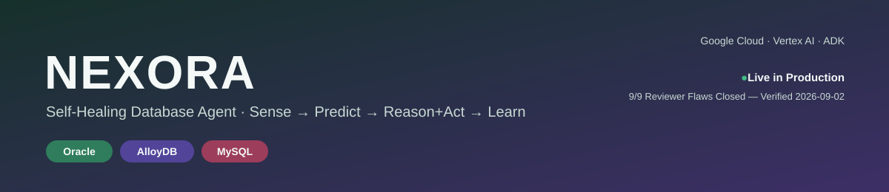
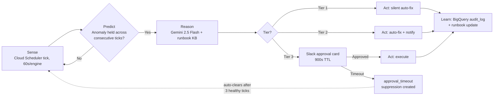
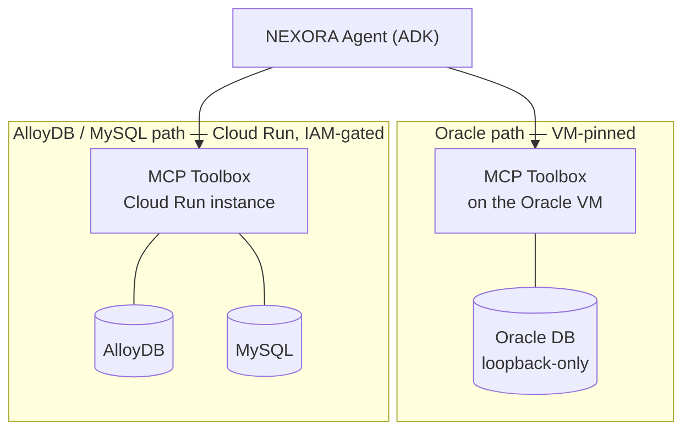

<p align="center">
  
</p>

<p align="center">
  
  
  
  
  
  
</p>

<p align="center">
  <a href="https://self-healing-orchestrator-casezd3hrq-uc.a.run.app/">
    
  </a>
  <a href="#architecture">
    
  </a>
  <a href="#safety-guardrails--three-tiers-live-verified">
    
  </a>
</p>

An autonomous agent that senses, diagnoses, and repairs production database
incidents — Oracle, AlloyDB, and MySQL — under a tiered human-approval
guardrail system, built on Google's Agent Development Kit (ADK) and deployed
live on Google Cloud. Built for the **Patchamomma 2026** hackathon.

## Highlights

- 🩺 **Three engines, one agent** — Oracle, AlloyDB, and MySQL reasoned over by the same ADK agent and guardrail stack, live on GCP.
- 🧠 **LLM-reasoned, not LLM-guessed** — Gemini 2.5 Flash proposes fixes from a fixed, allowlisted action set grounded in a runbook knowledge base; it can never invent an action.
- 🛡️ **Tiered autonomy** — silent auto-fix, auto-fix + notify, or a Slack approval card with a live 900-second TTL, depending on risk.
- 🔒 **No raw SQL, ever** — every action routes through an allowlisted MCP Toolbox tool; all credentials live in Secret Manager, never in source.
- 🧾 **Durable audit trail** — every incident's full onset-to-resolution sequence is written to BigQuery, off the critical remediation path.
- ✅ **9/9 external reviewer flaws closed**, each with a live-verified fix, 2026-09-02.

## How it works — Sense → Predict → Reason+Act → Learn

| Stage | What happens |
|---|---|
| **Sense** | Cloud Scheduler ticks each engine every 60s; the agent polls connection counts, blocking sessions, idle-in-transaction sessions, and runaway queries through an allowlisted MCP Toolbox tool — never raw SQL. |
| **Predict** | An anomaly must hold across consecutive ticks before it's treated as real — a built-in guard against false positives, not a bolt-on filter. |
| **Reason + Act** | Vertex AI (Gemini 2.5 Flash) reasons over the incident against a runbook knowledge base and proposes a fix from a fixed, allowlisted action set — the model can never propose an arbitrary action. The chosen tier below decides what happens next. |
| **Learn** | Every resolved incident — its diagnosis, action, and outcome — is embedded back into the runbook store, so the next similar incident resolves faster. |

## Safety guardrails — three tiers, live-verified

| Tier | Behavior |
|---|---|
| **Tier 1** | Silent auto-remediation for low-risk, well-understood actions. |
| **Tier 2** | Auto-remediation + notification — the fix applies immediately, a human is told after the fact. |
| **Tier 3** | Human approval required before anything runs. A request is posted to Slack; if unanswered within a 900-second TTL, it correctly expires (`approval_timeout`) rather than defaulting to either action. |

**Tier 3 — Human Approval (Slack).** When an action requires sign-off,
NEXORA posts an approval card to a dedicated Slack channel via an Incoming
Webhook. The webhook URL is treated as a secret — stored in Google Secret
Manager and injected into the orchestrator at runtime as the
`SLACK_WEBHOOK_URL` environment variable — and is intentionally excluded
from this repository.

Two more guardrails sit underneath the tiers: a resulting suppression
auto-clears after 3 consecutive healthy ticks (so a resolved incident
doesn't keep the dashboard stuck "open"), and a per-engine circuit breaker
trips to alert-only mode after 3 consecutive tool failures with a 2-minute
cooldown, so a misbehaving dependency can't turn into a remediation loop.

## Architecture

- **Three database engines, one shared agent.** Oracle, AlloyDB, and MySQL
  are all reasoned over by the same ADK agent and the same guardrail stack
  — not three separate integrations wearing a shared UI.
- **MCP Toolbox, split by blast radius (2026-09-02).** Oracle's Toolbox
  instance is VM-pinned by design (Oracle itself is loopback-only on that
  VM); AlloyDB and MySQL are served by their own IAM-gated Cloud Run
  Toolbox instance. A failure or compromise on one path can't reach the
  other — proven live by deliberately stopping the Oracle-side Toolbox
  container and confirming AlloyDB/MySQL kept operating normally.
- **No raw-SQL path exists anywhere in the system.** Every action the agent
  can take routes through an explicitly allowlisted MCP Toolbox tool.
  AlloyDB and MySQL sit on private IPs behind a VPC connector; Oracle is
  loopback-only. All credentials come from Secret Manager, never from
  source or environment files.
- **BigQuery is the source of truth**, not a side effect. The `db_ops`
  dataset's `audit_log`, `runbooks`, and `telemetry` tables record the full
  onset-to-resolution event sequence for every incident and feed the
  dashboard's MTTD/MTTR timeline directly — writes happen off the critical
  remediation path, so a slow audit write can never delay a fix.



**MCP Toolbox split — blast-radius isolation:**



## Tech stack

| Layer | Technology |
|---|---|
| Agent framework | Google ADK (`google-adk 2.7.1`) — `agent.py` wired to `guardrail_callbacks.py` and an allowlisted `db_tools.py` |
| Reasoning | Vertex AI — Gemini 2.5 Flash |
| Database access | MCP Toolbox for Databases (two instances — see Architecture) |
| Durable state | BigQuery (`db_ops` dataset) |
| Compute | Cloud Run (orchestrator + dashboard, one containerized service) |
| Scheduling | Cloud Scheduler (60s tick per engine) |
| Secrets | Secret Manager |
| Observability | Cloud Monitoring |
| CI path | `gcloud builds submit` against `cloudbuild.yaml` |
| Databases under management | Oracle (Compute Engine VM), AlloyDB, Cloud SQL for MySQL |

## External review — 9/9 flaws closed, live-verified 2026-09-02

Every item below was raised by an external reviewer and closed with a real,
observable fix — not just a documentation update:

- Oracle `ORA-65066` ruled out
- MySQL kill actions capped
- Tier 3 TTL auto-expiry, with the resulting suppression now auto-clearing
- MCP Toolbox blast-radius split (Oracle VM-pinned; AlloyDB/MySQL isolated)
- Automatic crash recovery
- Per-engine pipeline locks
- BigQuery audit writes moved off the critical remediation path
- Dashboard Cost-Avoided ROI panel
- (baseline) Hallucination firewall + allowlist governor with signed actions

Each of these maps to a general principle for running autonomous agents
against production infrastructure, not just a hackathon-specific bug fix —
see **[`ENTERPRISE.md`](ENTERPRISE.md)** for the full reframe, plus the case
for MCP over a direct database connection.

## Repository layout

This repo holds two runnable versions of NEXORA:

| Path | What it is |
|---|---|
| `gcp_deploy/` | **The production system** — everything currently live on GCP. `services/orchestrator/` is the Cloud Run service (agent, pipeline, guardrails, dashboard); `terraform/` is the infrastructure as code for every resource above; `tools_db/` holds the MCP Toolbox configs (`tools_cloudrun.yaml` is a safe placeholder template — real values are injected at deploy time, never committed); `demo_triggers/` are the staged-failure scripts behind the dashboard's demo buttons. |
| `adk_agent/` | A local ADK dev harness that mirrors the Cloud Run service, for iterating on agent logic without a full cloud deploy. |
| `*.py` (repo root) + `simulators/` | The original **zero-dependency local reference implementation** — the Sense→Predict→Reason→Act→Learn pipeline running entirely against local simulators, no GCP project or credentials required. Useful for understanding the reasoning loop in isolation. See **Quick start (local)** below. |
| `apply_*.py` | Incremental patch scripts documenting the hardening history of the orchestrator (each corresponds to a specific fix — TTL handling, connection thresholds, the Toolbox split, etc.). |

## Quick start (local, no GCP required)

```bash
pip install -r requirements.txt
python demo.py              # runs narrated end-to-end scenarios against local simulators
pytest test_safety.py -v    # the safety gate — same suite cloudbuild.yaml runs in CI
                             # → 17 passed (real, last verified 2026-09-07 — see VERIFICATION.md)
```

## See the live deployment

No setup needed — the production system is already running:

**[self-healing-orchestrator-casezd3hrq-uc.a.run.app](https://self-healing-orchestrator-casezd3hrq-uc.a.run.app/)**

The dashboard lets you switch between engines, watch the live per-tick
Agent Execution Loop, trigger a staged failure and watch Tier 1/2 auto-fix
it, or trigger a Tier 3 scenario and see the Slack approval card and
900-second countdown for yourself.

## Verification & reproducibility

Every specific number in this repo's documentation — test counts, the 9/9
reviewer-flaw closures, the live `/compliance` figures — is backed by a
command you can run yourself, not asserted from memory:

- **[`VERIFICATION.md`](VERIFICATION.md)** — the real, current test pass
  counts (60/60, 0 failing, last run 2026-09-07) and the real `curl`
  commands + responses used to check the live system's state.
- **[`REPRODUCE.md`](REPRODUCE.md)** — three independent ways to see
  NEXORA work yourself: the live system directly, the local zero-dependency
  reference implementation, or the production orchestrator's own test
  suite — none of which require a GCP project of your own.

## Security notes

- No real credentials, API keys, or webhook URLs are committed anywhere in
  this repository or its history — all secrets are injected at runtime from
  Secret Manager.
- The local reference implementation's `allowlist_governor.py` includes a
  `_bootstrap_reference_signoffs()` helper that auto-signs the shipped
  allowlist purely so the local demo runs out of the box. This does **not**
  exist in the production path — production signoffs in `gcp_deploy/` come
  from an actual reviewer, recorded in the signoff ledger.

## Author

Sneha Deepthi Cheenepalli
